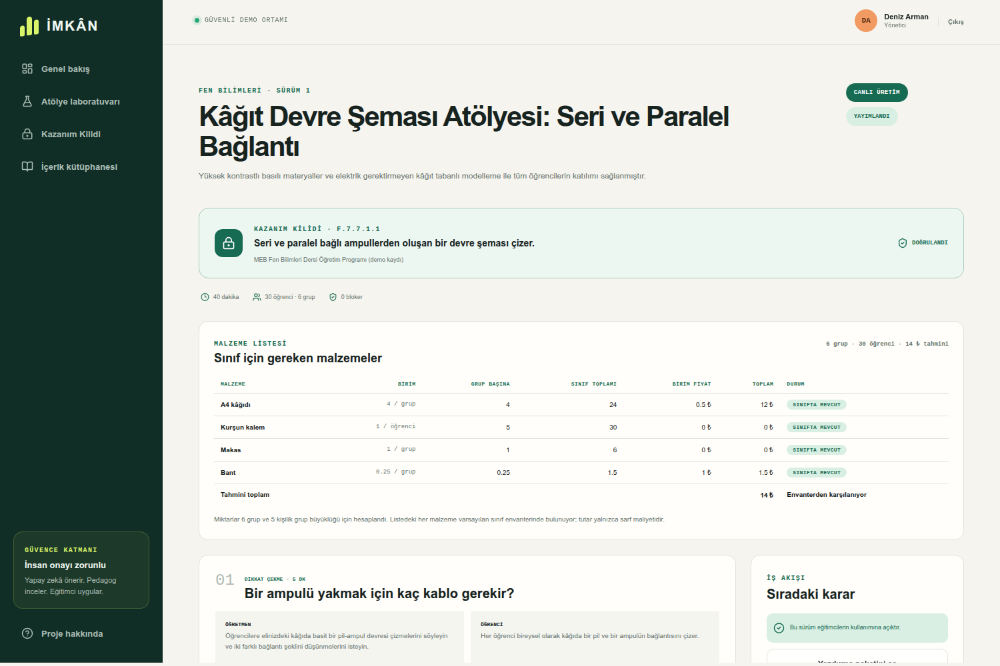

# İMKÂN

**Bilim Türkiye atölye konularını, merkezin gerçek imkânlarına uyarlanmış,
pedagog onaylı ve yazdırılabilir bir oturum paketine dönüştüren yapay zekâ
asistanı.**

> Atölye konusu sabit kalır; oturum, merkezin imkânlarına göre yeniden tasarlanır.

🔗 **Canlı demo:** https://d1a8sno49hnlhc.cloudfront.net

T3 Vakfı Bursiyer Yapay Zekâ Creathonu 2026 · **Problem 3 — Bilim Türkiye AI
Eğitim İçeriği Geliştirme Asistanı**



*Yapay zekâ tarafından yazılmış, pedagog onaylı ve yayımlanmış bir oturum
paketi. Konu kilitli; rota, malzeme listesi ve maliyet kod tarafından
hesaplanmış.*

---

## Hangi problemi çözüyor?

Bilim Türkiye 30 bilim merkezinde 6-14 yaş grubuna atölye eğitimi veriyor ve
merkezler aynı donanıma sahip değil: bazısında planetaryum var, bazısında
sergi alanı, bazısında hiçbiri. Bir eğitmen aynı atölye konusunu hazırlarken
şunları tek tek düşünmek zorunda: bir saate sığacak mı, katılımcılar kaç gruba
bölünecek, merkezde kubbe var mı, malzeme elde var mı, bütçeye sığıyor mu,
erişilebilirlik ihtiyacı olan katılımcı için alternatif ne olacak?

Hazır plan bankaları bu soruları cevaplamaz. Genel amaçlı bir sohbet robotu
ise elinizde olmayan malzemeyi ister, süreyi tutturmaz ve konuyu sessizce
değiştirir. Ortaya çıkan planın pedagojik olarak onaylandığına dair hiçbir iz
kalmaz.

**İMKÂN tam bu boşluğu doldurur:** konuyu kilitler, mekânın imkânlarını girdi
olarak alır, aynı konuya ulaşan farklı bir rota üretir ve uygulanamayan
rotanın nedenini yazar.

## Neyi kolaylaştırıyor?

| Önce | İMKÂN ile |
|---|---|
| Plan hazırlamak saatler sürer | Koşulları seçip saniyeler içinde paket üretilir |
| Elinizde olmayan malzeme önerilir | Yalnızca işaretlediğiniz malzemeler kullanılır |
| Bütçe sonradan fark edilir | Maliyet hesaplanır, bütçeyi aşarsa üretim durdurulur |
| Süre tahminidir | Aşama süreleri istenen süreye birebir bölünür |
| Merkezde kubbe veya sergi yoksa plan çöker | Onaylı alternatif rotaya geçilir, nedeni yazılır |
| "Bunu kim onayladı?" belirsizdir | Her sürümün pedagog onayı ve karar geçmişi kayıtlıdır |
| Alışveriş listesi elle çıkarılır | Grup başına ve oturum toplamı malzeme listesi hazır gelir |

### Somut örnek

**Uzay Çağı** temasındaki *"Uzay Gözlem Araçları: Kendi Modelini Kur"* konusu,
aynı oturum, iki merkez:

**Bilim Trabzon** (80 kişilik 12 m kubbe yayımlanmış) seçildiğinde İMKÂN
planetaryum rotasını seçer: kubbede aynı gökyüzü çıplak gözle ve teleskop
görüş alanıyla gösterilir, pakete kubbe güvenlik kuralı eklenir.

**Bilim Çorum** (kubbe yayımlanmamış) seçildiğinde kâğıt tüp modeli rotasına
geçer, nedenini yazar (*"Mekânda gereken donanım yok: Planetaryum"*) ve
yayımlanmamış donanımı "yok" saymadığını belirterek eğitmene işaretleme
imkânı bırakır.

Format **Çevrim İçi**'ye alındığında kubbe rotası yine düşer, ama bu kez farklı
ve doğru bir gerekçeyle: katılımcı evdedir.

## Yapay zekâ nerede devreye giriyor?

Oturumun **metnini** bir dil modeli yazar: aşama başlıkları, eğitmen ve
öğrenci yönergeleri, öğrenme kanıtı ve konu bağlantısı.

Modelin **dokunamadığı** şeyler kod tarafından yeniden hesaplanır:

- 5E aşamalarının sayısı ve sırası
- Aşama sürelerinin dağılımı ve toplamı
- Grup sayısı, malzeme miktarları ve maliyet
- Bütçe, güvenlik ve kapasite kontrolleri
- Kilitli atölye konusu
- Rota uygunluğu: merkez donanımı, malzeme, format ve bütçe

Taslak kaydedilirken sunucu iskeleti sıfırdan yeniden üretir ve yalnızca
incelenen metni üzerine yerleştirir. Bu nedenle model, elinizde olmayan bir
malzemeyi veya bütçeyi aşan bir kurulumu kayda geçiremez.

Sağlayıcı yavaşlarsa, boş yanıt dönerse veya sözleşmeyi bozarsa sistem
**doğrulanmış çevrimdışı plana düşer** ve bunu bir uyarı olarak bildirir.
Üretim her koşulda kullanılabilir bir atölye döndürür.

## Rol akışı

```
İçerik uzmanı        Pedagog                 Yönetici        Eğitmen 
─────────────        ───────                 ────────        ────────
koşulları girer  →   konu bağlantısını
paketi üretir        ve kanıtları inceler →  yayımlar    →   uygular
taslağı gönderir     onaylar / revizyon                      yazdırır
                     ister                                   geri bildirim
                                                             bırakır
```

Kendi paketini onaylamak engellidir. Değişiklik istenen sürüm dondurulur, yeni
sürüm oluşturulur ve eski sürüm "eski sürüm" olarak kayıtta kalır. Eğitmen geri
bildirimi yöneticinin yeniden kullanım özetine düşer.

## Şu an çalışan kısım

Uçtan uca çalışan, herkese açık bir dikey dilim:

- Bilim Türkiye'nin yayımlanmış atölye kataloğu: 7 tema × 3 yaş grubu × 183 konu
- Onaylı içeriği olmayan katalog konuları için taslak öneri üretimi ve
  pedagog onayına giren içerik geliştirme akışı
- Kaynak profili formu: süre, sınıf/grup mevcudu, bütçe, elektrik, internet,
  malzeme ve erişilebilirlik
- Dil modeliyle canlı üretim (`APP_MODE=live`) ve deterministik yedek
- Her çıktı için en az iki gerçek rota; reddedilen rotanın nedeni yazılır
- Rota güvenlik kısıtları (ör. mercekle Güneş'e bakma yasağı) uyarı olarak eklenir
- Grup başına ve sınıf toplamı malzeme listesi, maliyet ve envanter durumu
- Öğrenme çıktısı–kanıt izlenebilirliği olan beş aşamalı 5E planı
- Taslak → inceleme → onay → yayım → geri bildirim iş akışı
- Değişmez sürüm geçmişi ve denetlenebilir durum geçişleri
- Puan dağılımıyla oturum geri bildirimi ve yöneticiye yeniden kullanım özeti
- Yazdırılabilir eğitmen paketi (öğretmen/öğrenci yönergeleri, malzeme tablosu)
- Onay bekleyen kayıt akışı ve yönetici tarafından rol atama
- Argon2id şifreleme, iptal edilebilir sunucu tabanlı oturumlar
- HTTPS yayın, gerçek tarayıcı testleri ve erişilebilirlik denetimi

**Dürüst kapsam sınırı:** Bilim Türkiye'nin yayımlanmış atölye kataloğu tam
olarak modellenmiştir — yedi tema, üç yaş grubu, **183 konu**, kaynak
sayfalarıyla. Bu konuların yalnızca **6 tanesinin** İMKÂN'da onaylı içeriği
vardır (2/7 tema, 1/3 yaş grubu: hepsi 12-14 yaş); yedinci onaylı konu olan
"Besin Zinciri" katalogda birebir karşılığı olmadığı için katalog dışı olarak
işaretlenmiştir. Onaylı içeriği olmayan bir konu seçildiğinde İMKÂN taslak
öneri üretir; bu taslak her ekranda "TASLAK ÖNERİ" olarak etiketlenir ve
pedagog onayı almadan onaylı içerik sayılmaz. Sayaçlar korpustan hesaplanır,
elle yazılmaz. Konuların okul kazanımıyla tamamlayıcılığı MEB'in ünite
sayfalarından birebir aktarılmıştır ancak **alan uzmanı doğrulaması
beklemektedir**. 5E, İMKÂN'ın aşama iskeletidir; Bilim Türkiye'nin kendi
yaklaşımı "Yaparak Yaşayarak Öğrenme" ve proje tabanlı çalışmadır ve İMKÂN
bunu uygulamaz. Çok oturumlu uzun süreli programlar modellenmemiştir; format
seçilebilir ancak plan tek oturumu kapsadığını yazar.

## Hızlı başlangıç

Gereksinim: Node.js 24+

```bash
npm install
npm run db:migrate
npm run db:seed
npm run dev
```

`http://localhost:3000` adresini açın ve **Atölye laboratuvarı**'na girin.
Varsayılan profil ana demo senaryosunu kurar: 30 öğrenci, bir saatlik okul
grubu oturumu, merkez donanımı yok, yalnızca temel kırtasiye.

Yerel hesaplar (`DEMO_PASSWORD` verilmezse şifre `I.mkanDemo!2026`):

| Hesap | Rol |
|---|---|
| `content@imkan.test` | İçerik uzmanı |
| `pedagogue@imkan.test` | Pedagog |
| `educator@imkan.test` | Eğitmen |
| `manager@imkan.test` | Yönetici |

Herkese açık kayıtla oluşturulan hesaplar, bir yönetici etkinleştirene kadar
onay bekler; rol ve oturum almaz.

### Canlı üretimi açmak

```bash
cp .env.example .env
# .env içindeki LLM_API_KEY değerine OpenAI proje API anahtarını girin
APP_MODE=live npm run dev
```

`APP_MODE` `live` değilse veya anahtar yoksa sistem deterministik modda kalır.
Ekonomik canlı testler için varsayılan sağlayıcı ayarları şunlardır:

```dotenv
LLM_BASE_URL=https://api.openai.com/v1
LLM_MODEL=gpt-5.6-luna
LLM_API_KEY=anahtarınızı-buraya-yazın
```

GitHub staging ortamında anahtar `LLM_API_KEY` adlı environment secret; URL ve
model ise `LLM_BASE_URL` ve `LLM_MODEL` adlı environment variable olarak
tutulur. Sunumda yalnızca `LLM_MODEL` değişkeni `gpt-5.6-terra` yapılarak daha
güçlü modele geçilebilir.

### Doğrulama

```bash
npm run check      # lint + 446 birim testi + üretim derlemesi
npm run check:all  # yukarısı + 39 tarayıcı testi
```

Tarayıcı testleri Docker gerektirmez: gömülü PGlite üzerinde aynı PostgreSQL
göçlerini çalıştırır ve ağ çağrısı yapmaz.

## Teknoloji

Next.js 16 · TypeScript · PostgreSQL + Drizzle · Argon2id · Zod · Playwright +
axe · Docker · AWS ECS Fargate + RDS + CloudFront · GitHub Actions OIDC

## Belgeler

| Belge | İçerik |
|---|---|
| [Ürün özeti](docs/01-product-brief.md) | Problem, kullanıcılar, kapsam |
| [Gereksinim izlenebilirliği](docs/02-requirements-traceability.md) | Creathon şartlarıyla eşleme |
| [Teknik mimari](docs/03-technical-architecture.md) | Bileşenler ve veri akışı |
| [Yapay zekâ üretimi ve doğrulama](docs/04-ai-generation-validation.md) | Sağlayıcı sözleşmesi, güvenceler |
| [Veri, API ve güvenlik](docs/05-data-api-security.md) | Şema, uç noktalar, tehdit modeli |
| [Derleme, test ve demo](docs/06-build-test-demo.md) | Doğrulama planı |
| [Yayın](docs/07-deployment.md) | AWS topolojisi |
| [Üretim el kitabı](docs/09-production-runbook.md) | İşletme adımları |

## Güvenlik ve gizlilik notu

Herkese açık demoya gerçek öğrenci verisi, kişisel veri veya gerçek şifre
girmeyin. Kenar (CloudFront) ile uygulama arasındaki iç bağlantı, alan adı
alınana kadar HTTP'dir; yük dengeleyici yalnızca CloudFront kaynak aralıklarını
kabul eder. `.env*` dosyaları Git ve Docker derleme bağlamı dışındadır.

Creathon problem kitapçığı izlenebilirlik için yerelde tutulur; yeniden dağıtım
izni doğrulanana kadar herkese açık depoya eklenmemiştir.
